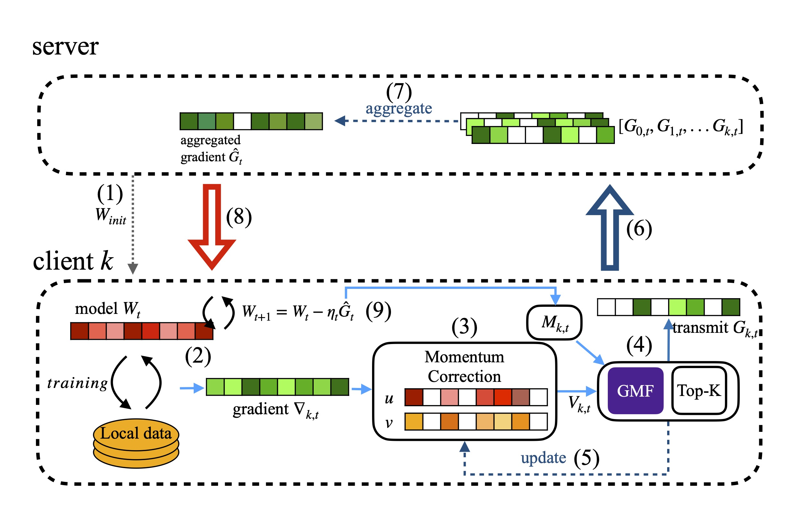

# global-momentum-fusion-fl

## Introduction

This repository is an official implementation of this paper. arXiv (wait for confirm) 
```
Improving Federated Learning Communication Efficiency with Global Momentum Fusion for Gradient Compression Schemes
```

As description in the paper, we propose global-momentum-fusion method to reduce communication overheads. 
The following figure demonstrate how global-momentum-fusion work with DGC in federated learning trading flow.



## Dataset prepare

[Detail](data/README.md)

## Training
### Cifar10 dataset

```shell=
# usage
In our cifar10 experiment:
seed=123 gpu=0 tbpath=./cifar10_repo_test compress_method="DGC" bash train_cifar10.sh
seed=123 gpu=0 tbpath=./cifar10_repo_test compress_method="GFDGC" bash train_cifar10.sh
seed=123 gpu=0 tbpath=./cifar10_repo_test compress_method="SGC" bash train_cifar10.sh
seed=123 gpu=0 tbpath=./cifar10_repo_test compress_method="GFGC" bash train_cifar10.sh
```
### Shakespeare dataset
```shell=
In our shakespeare experiment:
seed=123 gpu=0 tbpath=./sha_repo_exp compress_method="DGC" bash train_sha.sh
seed=123 gpu=0 tbpath=./sha_repo_exp compress_method="GFDGC" bash train_sha.sh
seed=123 gpu=0 tbpath=./sha_repo_exp compress_method="SGC" bash train_sha.sh
seed=123 gpu=0 tbpath=./sha_repo_exp compress_method="GFGC" bash train_sha.sh
```